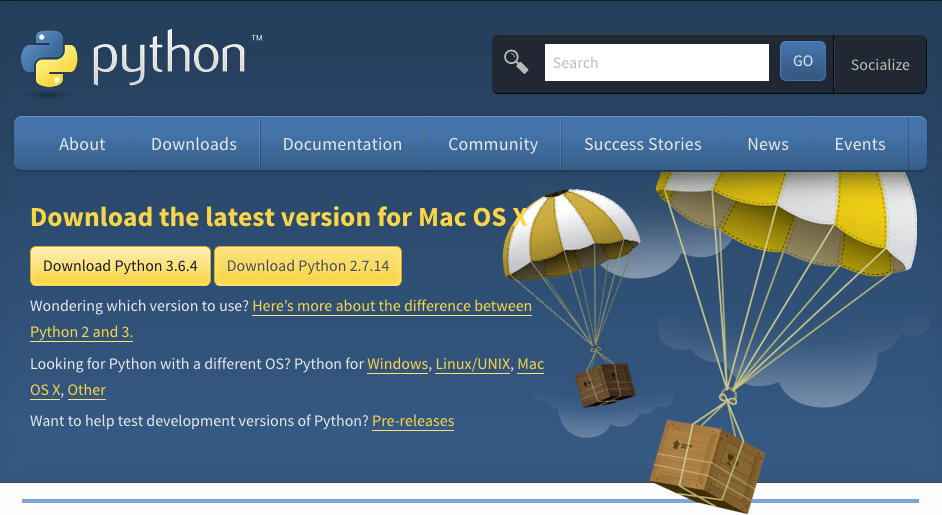
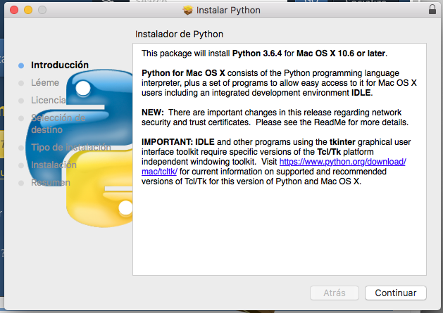
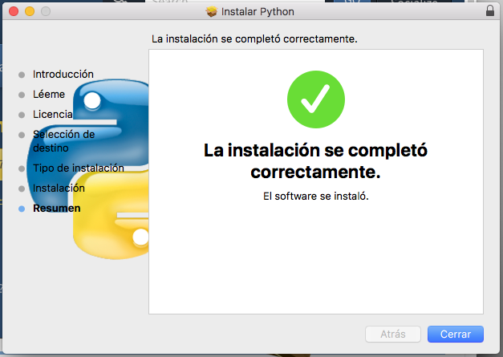
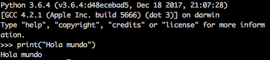
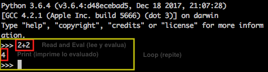

# Aprende Python de la manera Correcta

##Introducción a Python

Python es un lenguaje de programacion moderno y de proposito general, fue desarrollado en su mayoria por Guido Van Rossum, actualmente es quien dicta el rumbo del lenguaje.

Python ha sido reconocido por su sintaxis clara y directa, con comandos muy naturales y parecidos al Ingles natural. Su nombre proviene de la comedia inglesa Monthy Python FLying Cirus.

El lenguaje es de scripting, lo que significa entre otras cosa que no necesita ser compilado y es interpretado (evaluado) una linea a la ves. Fue y sigue siendo punta de lanza en su categoria, sentando las bases para algunos lenguajes modernos y el desarrollo de scripting en general.

Funciona lo mismo para windows y linux, para web que para escritorio, incluso hay algunas implemantaciones para Moviles, es de tipado dinamico. y cuanta con un REPL para su acceso desde la terminal.

## Instalemos Python

Instalar python es una tarea que se puede hacer de manera versatil, en este libro nos enfocaremos a la manera que personalmente me parece la mejor en terminos del tu aprendizaje, aunque estoy seguro que encontraras maneras mas faciles o rapidas por ahi.

### Mac

Apple OSX es un sistema operativo basado en Free BSD una version de Linux que utiliza Python en algunas de sus rutinas y programas por lo que ya tiene instalada la version 2.7 del lenguaje, podras verificarlo usando los siguientes comandos en la terminal.

```shell
	python -V // esa es una V mayuscula...
```

Sin embargo la version mas actualizada es python 3 y es la que utilizaremos por razones que ire explicando mas adelante en este libro

Para instalar python 3 es necesario ir a [https://www.python.org/downloads/](https://www.python.org/downloads/)



Una ves descargado el fichero sigue el wizzard y estaras listo para seguir...



Ahora tienes instalado en tu sistema Pyhton y Python 3, por lo que para revisar la version deberas hacerlo en especifico para Python 3

```shell
	python3 -V
```

// TODO
### Windows 
### Linux
// TODO

## Mi primer script en python

Conforme vayamos avanzando en el libro voy a ir mesclando palabras en Ingles que son claves en el calo de programadores, como script que significa guion, podras encontrar un significado y una explicacion mas amplia siguiendo la liga.

Para hacer nuestro primer programa en Python entremos al REPL de python.

```shell
	python3
```

Despues de los tres simbolos de mayor que escribe ` print("Hola Mundo")`
el resultado sera similar a esto.



Muxhas felicidades, has escrito tu primer programa informatico, y aunque quiza paresca muy poco recuerda que los grandes programas se hacen una linea a la ves, al terminar este libro tendras las bases para hacer aplicaciones web, de escritorio, o para dispositivos usando Python, asi que el viaje apenas empieza.

#Lenguaje de script vs compilado

Aunque se quepara un programador "tirar codigo" es lo mas divertido, es necesario que las bases del desarrollo sean cubiertas antes de continuar para asi saber como y por que las cosas funcionan.

Los lenguajes de programacion son un acercamiento al lenguaje Ingles, la idea es hacer la programación lo mas humana posible para que los que hacemos software lo hagamos rapido y bien, pero realmente las computadoras no entienden el ingles. Las computadoras solo leen ceros y unos. asi es que `print("Hola mundo")` es traducido a ceros y unos o Machine Code.

Imagina que esa instruccion es algo similar a...

```
01001010 0001001010 01001010 0001001010 01001010 0001001010
01001010 0001001010 01001010 0001001010 01001010 0001001010
01001010 0001001010 01001010 0001001010 01001010 0001001010 
01001010 0001001010 01001010 0001001010 01001010 0001001010
01001010 0001001010 01001010 0001001010 01001010 0001001010
01001010 0001001010 01001010 0001001010 01001010 0001001010
01001010 0001001010 01001010 0001001010 01001010 0001001010
01001010 0001001010 01001010 0001001010 01001010 0001001010
01001010 0001001010 01001010 0001001010 01001010 0001001010
01001010 0001001010 01001010 0001001010 01001010 0001001010
01001010 0001001010 01001010 0001001010 01001010 0001001010
01001010 0001001010 01001010 0001001010 01001010 0001001010
01001010 0001001010 01001010 0001001010 01001010 0001001010
```

En un principio los lenguajes de programación tenian que ser compilados, lo que signinfica que pasaban las traducciones escritas en un programa a ceros y unos, esto regresaba un archivo compilado y ejecutable.

Te imaginas compilar tu codigo cada ves que vas a hacer pruebas y despues correrlo?

Hagamos un ejercicio con C, uno de los mejores lenguajes de programación que existen.

```
#include <stdio.h>
int main()
{
   printf("Hola Mundo!"); // te parece conocido esto?
   return 0;
}
```

Supon que tenemos un archivo con lo anterior dentro de el, este codigo hace exactamente lo mismo que el `print("Hola Mundo")` en python.

Ahora compilemoslo
```
clang mi_programa.c
```

Lo antorior creara un archivo llamado `a.out` este lo podemos ejectuar y nos imprimira en pantalla 

```Hola Mundo```


Hagamoslo de nuevo:

1. Editemos el codigo
2. Compilemos
3. ejecutemos 
4. Repetir hasta terminar.

Este es el proceso que se hace con los lenguajes compilados, ahora veamos como funcionan los lenguajes interpretados o de script.

Todos los lenguajes interpretados vienen integrados con un REPL que es un programa que hace un prioceso similar al que acabamos de ver 

1. Read (Leer el codigo)
2. Evaluate (Evaluar)
3. Print (Imprimir el resultado de la evaluacion)
4. Loop (Repetir hasta terminar)

Como puedes ver el proceso es muy similar y es que los lenguajes interpretados tienen un traductor que no necesita compilar el codigo, lo evalua linea a linea y lo compila y ejecuta al mismo tiempo, despues imprime el resultado en pantalla y repite esto hasta que termina el archivo.


Veamos un poco mas a fondo como funciona el REPL de python.

```
	python3
```
		
Las computadoras en una manera muy elemental de verlas son calculadoras super potentes, asi que hagamos algunos calculos, python puede sumar dividir, restar y multiplicar de manera sencilla, intenta hacerlo varias veces repitiendote los pasos.

Read, Eval, Print, Loop




	Por que hay lenguajes de scriptspr
 ncipales
 diferencias  
#En endiendo el 
EPL 	Hacer incapie en

la 
	valuacion
#Ka el el robot y la introduccion a la
prog
amacio  
# Ejercicios con
Karel el robot
	Real
	zar juegos y ejercicios para ir aumentando la dificultad con el tiempo
 
  